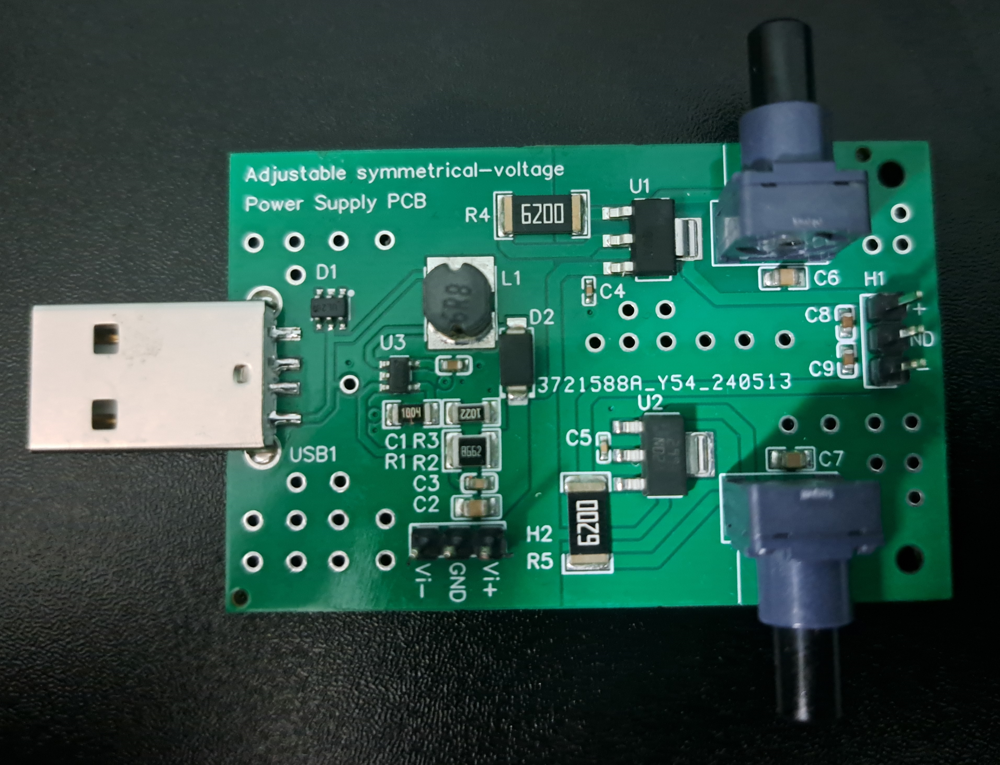
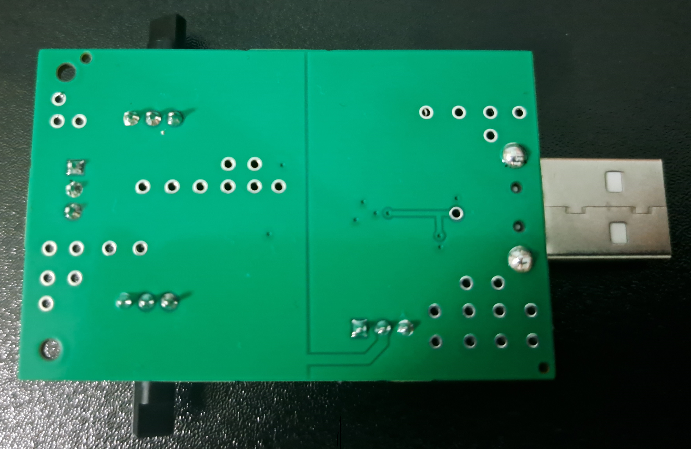

# Adjustable Symmetrical Voltage Power Supply

Welcome to the **Adjustable Symmetrical Voltage Power Supply** repository! This project provides a versatile and adjustable symmetrical voltage power supply designed using EasyEDA CAD program. The repository includes the schematic diagram and PCB design files.

## Table of Contents

- [Introduction](#introduction)
- [Features](#features)
- [Specifications](#specifications)
- [Setup and Usage](#setup-and-usage)
- [Schematic and PCB Design](#schematic-and-pcb-design)
- [Warnings and Precautions](#warnings-and-precautions)
- [License](#license)

## Introduction

This PCB board is designed to provide a stable and adjustable symmetrical voltage output, making it ideal for powering microelectronic devices. The board can be powered through a USB Type A port or external power supply via pin headers.

## Features

- Adjustable symmetrical voltage output
- Input via USB Type A port or external power supply
- Easy-to-use potentiometers for voltage adjustment
- Compact design suitable for various applications

## Specifications

- **Input Voltage:**
  - USB Type A: +5V and -5V
  - Pin Headers: Vi-, GND, Vi+
- **Output Voltage:**
  - Adjustable via potentiometers
  - Measured at V-, GND, V+ pin headers
- **Applications:**
  - Suitable for powering simple microelectronic devices

## Setup and Usage

1. **Powering the Board:**
   - **Via USB Type A port:** Connect the USB cable to provide +5V and -5V.
   - **Via Pin Headers:** Connect the external power supply to Vi-, GND, and Vi+ headers.

2. **Adjusting the Voltage:**
   - Use the two potentiometers to adjust the output voltage levels.
     - One potentiometer controls the positive voltage level.
     - The other potentiometer controls the negative voltage level.

3. **Measuring the Output:**
   - Measure the output voltage at the V-, GND, V+ pin headers.

## Schematic and PCB Design

The repository contains the following files:
- Schematic diagram
- PCB design files

You can view and edit these files using the EasyEDA CAD program.

## Warnings and Precautions

- Ensure the input power does not exceed the specified limits to avoid damage.
- The board is designed for low to moderate power applications. Do not overload the board with high power devices.
- Proper heat dissipation should be considered when operating at higher power levels.

## PCB Board

Top side of the board:

Bottom side of the board:

